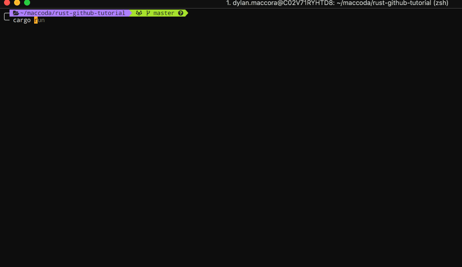

# Getting Started

## Getting Rust

Firstly install Rust from [here]. This will install Rustup which is the
toolchain manager for Rust. Once this has been installed you will have the
language and the main tooling required

## Creating a project

You won't actually need to complete this step as the source code will be located
in this repository, however if you were wanting to play around prior you can
create a project with the build tool `Cargo`.

## Setting up your IDE

Rust now has extensions in most IDEs, and is constantly [improving support]

- [Atom]
- [Emacs]
- [IntelliJ]
- [Sublime]
- [Vim]
- [VSCode]

[here]: https://www.rust-lang.org/en-US/install.html
[improving support]: https://areweideyet.com/
[Atom]: https://atom.io/packages/ide-rust
[IntelliJ]: https://intellij-rust.github.io/
[Emacs]: https://github.com/rust-lang/rust-mode
[Sublime]: https://packagecontrol.io/packages/Rust%20Enhanced
[Vim]: https://github.com/rust-lang/rust.vim
[VSCode]: https://marketplace.visualstudio.com/items?itemName=rust-lang.rust